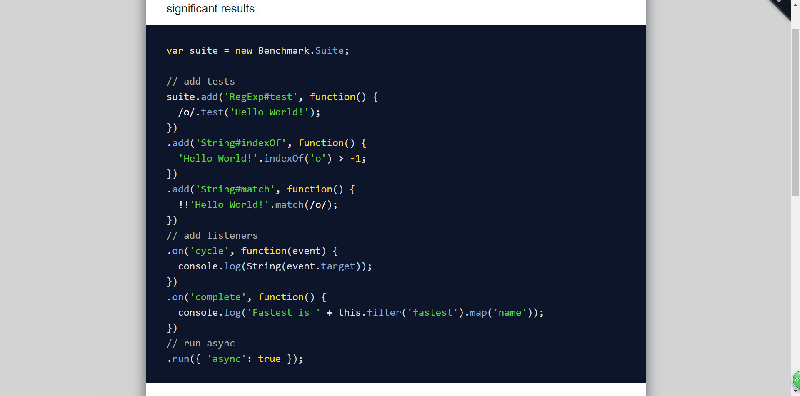
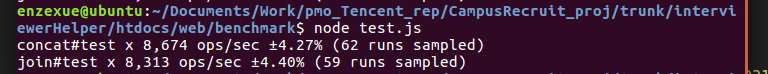
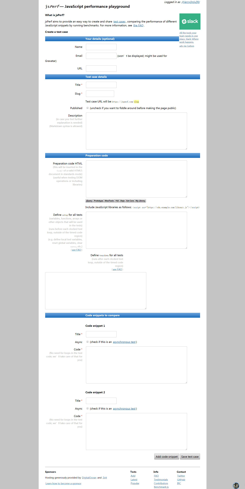
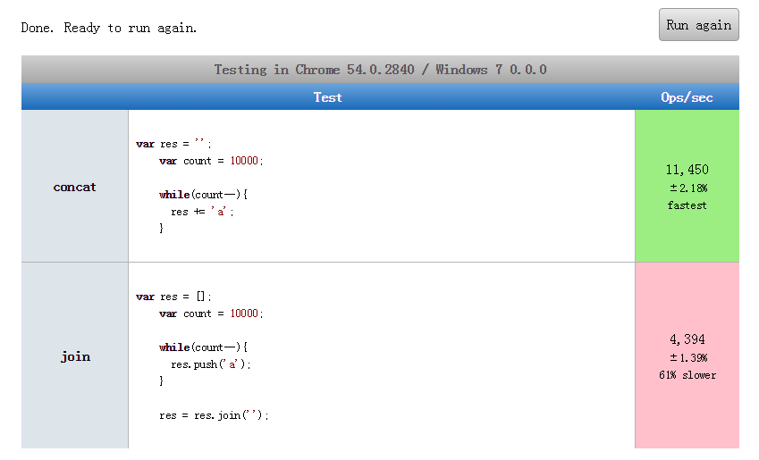

## ——从Webkit内部渲染机制出发，谈网站渲染性能优化

本文是对前文： <http://imweb.io/topic/5b6fd3c13cb5a02f33c013bd>   相关知识的补充，文中的“前文”一词同此。

特以此文向《WebKit技术内幕》作者朱永盛前辈致敬。

## 0.引言

自上次发布了《网站性能优化实战——从12.67s到1.06s的故事》一文后，发现自己对页面渲染性能这个版块介绍的内容还不够完善，为了更清晰的梳理浏览器渲染页面的机制，以让读者更为全面了解渲染性能优化的深层次原理，笔者在课余时间重新研读了一遍《WebKit技术内幕》一书，将自己的总结经验分享予论坛同僚。

让我们用自己的双手，创造出极致的页面渲染性能。

因为本文是基于前文的基础上拓展了相关内容，所以可能会有部分文字重复，希望大家不要介意。

## 1.浏览器内核

还是献上前文的那张浏览器渲染引擎、HTML解释器、JS解释器关系图：


我们平时打开浏览器所看到的界面，就是图里的User Interface，我们常说的浏览器内核，指的就是我们的渲染引擎——Rendering engine，最著名的还属Chrome的前任、Safari的搭档WebKit，我们使用的大多数移动端产品（Android、IOS 等等）都是使用的它，也就是说我们可以在手机上实现我们的CSS动画、JS交互等等效果，这也是我们的前端开发人员能够开发出Web和Hybrid APP的原因，包括现在的Blink，其实也应该算是Webkit的一个变种，它是从WebKit衍生来的，但是Google在和WebKit分手后便在Blink里使用了声名远播的V8引擎，打出了一场漂亮的翻身战。还有IE的Trident，火狐的Gecko浏览器内核，平时我们需要为部分CSS样式添加兼容性前缀，正是因为不同的浏览器使用了不同的渲染引擎，产生了不同的渲染机制。

渲染引擎内包括了我们的HTML解释器，CSS样式解释器和JS解释器，不过现在我们会常常听到人们说V8引擎，我们经常接触的Node.js也是用的它，这是因为JS的作用越来越重要，工作越来越繁杂，所以JS解释器也渐渐独立出来，成为了单独的JS引擎。

## 2.浏览器架构

在你深入探知浏览器内部机理之前，你必须知道，浏览器是多进程、多线程模型，这里我们以基于Blink内核的Chromium浏览器为例，讲讲在Chromium浏览器中，几个常见的进程：

* Browser进程：这是浏览器的主进程，负责浏览器界面的显示、各个页面的管理。每次我们打开浏览器，都会启动一个Browser进程，结束该进程就会关闭我们的浏览器。
* Renderer进程：这是网页的渲染进程，负责页面的渲染工作，一般来说，一个页面都会对应一个Renderer进程，不过也有例外。
* GPU进程：如果页面启动了硬件加速，浏览器就会开启一个GPU进程，但是最多只能有一个，当且仅当GPU硬件加速打开的时候才会被创建。

刚刚我们提到的所有进程，他们都具有如下特征：

1. Browser进程和页面的渲染是分开的，这保证了页面渲染导致的崩溃不会导致浏览器主界面的崩溃。
2. 每个页面都是独立的进程，这样就保证了页面之间不会相互影响。
3. GPU进程也是独立的。

为了能让大家更为直观的理解Chromium多进程模型，笔者附上一张Chrome浏览器在Windows上的多进程示例图：（打开任务管理器，将进程按照“命令行”排序，找到“Google Chrome”相关内容）


从进程的type参数中，我们可以区分出不同类型的进程，而那个不带type参数的进程，指的就是我们的Browser浏览器主进程。

每个进程的内部，都有很多的线程，多线程的主要目的就是为了保持用户界面的高响应度，保证UI线程（Browser进程中的主线程）不会被被其他费事的操作阻碍从而影响了对用户操作的响应。就像我们平时所说的JS脚本解释执行，都是在独立的线程中的，这也是JS这门编程语言特立独行的地方，它是单线程脚本。

在这里做一些简单的拓展，大家看看下面这段代码：

```js
setTimeout(function(){
  console.log("我能被输出吗？")
}, 0)
while(true){
  var a = 1;
}
```

大家肯定都知道因为线程阻塞，定时器里的console并不会被输出，这就是因为我们的JS解释执行是单线程的，所以在执行过程中需要将同步和异步的两类代码分别压入同步堆栈和异步队列中，通过Event Loop实现异步操作：


也就说我们的JS定时器其实并不是完全准确的，还需要考虑同步堆栈中代码执行产生的延迟。

不过现在有很多技术可以让我们的JS代码模拟多线程执行，包括之前一位日本大牛编写的一个名为`Concurrent.Thread.js` 的插件，还有HTML5标准中提出的Web Worker，这些工具都能让我们实现多线程执行JS代码的效果。

## 3.HTML网页结构及渲染机制浅析

在了解浏览器渲染机制之前你必须理解浏览器的层级结构，或许你知道浏览器的渲染频率是60fps，知道浏览器的页面呈现就如同电影般是逐帧渲染的效果，但并不代表页面就像胶片一样，从头至尾都是单层的。页面所经历的，是从一个像千层面一样的东西一步步合成的过程，中间经历了软硬件渲染等等过程，最后形成一个完整的合成层才被渲染出来。千层面的效果大概就像Firefox的3D View插件所呈现出的那般：


有人可能会说刨得这么深我们实际开发中用得到吗？如果我这么和你说“性能优化不是讲究减少重排重绘嘛，我现在手上有一套方案，能让你的页面动画直接跳过重排重绘的环节”，你是否会对此产生一点兴趣？不过不着急，在我们还没有把其中原理理清之前，我是不会草率地放出解决方案的，不然很容易就会让大家的思想偏离正轨，因为我就是经历了那样一个惨痛的过程过来的。

如果要验证我上述所言非凭空捏造，大家可以打开chrome开发者工具中的performance版块，录制一小段页面渲染，并将输出结果切换至Event Log版块，大家就可以清晰地看见网站渲染经历的过程：


在Activity字段中我们可以看到，我们的页面经历了重新计算样式→更新Layer树→绘制→合成合成层的过程，结合我们的Summary版块中的环形图，我们可以大致把页面渲染分为三个阶段：


* 第一阶段，资源加载及脚本执行阶段：在Summary图中我们可以看到，页面在渲染时蓝色的Loading（资源请求）部分和黄色的Scripting（脚本执行）部分占用了大量的时间，可能是因为我们请求的资源体积较多，执行的脚本复杂度较大，我们可以依据网络传输性能优化的相关内容对这一阶段进行优化。
* 第二阶段，页面布局阶段：在Summary图中，紫色的Rendering部分指的就是我们的layout页面布局阶段，在Event Log版块之所以没有看到layout activity，是因为我启动了硬件加速，使得页面在重新渲染时不会发生重排，可能对这句话你现在还听的云里雾里，等你看完这篇文章，你就会明白其中道理的。之所以把layout单独提取出来，是因为它是一个很特别的过程，它会影响RenderLayers的生成，也会大量消耗CPU资源。
* 第三阶段，页面绘制阶段：其中就包括了最后的Painting和Composite Layers的所有过程。

## 4.DOM树及事件机制

如果你学过计算机网络，或者数字电子技术，那么你一定知道，资源在网路中传输的形式是字节流。我们每次请求一个页面，都经过了字节流→HTML文档→DOM Tree的过程，其中细节我已在前一篇文章中的navigation timing版块作了详细介绍，今天我们只谈DOM树构建之后浏览器的相关工作。


DOM树的根是document，也就是我们经常在浏览器审查元素时能看到的HTMLDocument，HTML文档中的一个个标签也被转化成了一个个元素节点。

既然说到了DOM树，就不得不提及浏览器的事件处理机制。事件处理最重要的两个部分便是事件捕获（Event Capture）和事件冒泡（Event Bubbling）。事件捕获是自顶向下的，也就是说事件是从document节点发起，然后一路到达目标节点，反之，事件冒泡的过程则是自下而上的顺序。


我们常使用`addEventListener()` 方法来监听事件，它包含三个参数，前两个大家都太熟悉，我们来聊聊第三个参数，MDN上将它称作useCapture，类型为Boolean。它的取值显而易见，便是true和false（默认），如果设置为true，表示在捕获阶段执行回调，而false则是在冒泡阶段执行，它决定了父子节点的事件绑定函数的执行顺序。

## 5.RenderObject和RenderLayer的构建

在DOM树之中，某些节点是用户不可见的，也就是说这些只是起一些其他方面而不是显示内容的作用。例如head节点、script节点，我们可以称之为“非可视化节点”。而另外的节点就是用来展示页面内容的，包括我们的body节点、div节点等等。对于这些“可视节点”，因为WebKit需要将它们的内容渲染到最终的页面呈现中，所以WebKit会为他们建立相应的RenderObject对象。一个RenderObject对象保存了为了绘制DOM节点所需要的各种信息，其中包括样式布局信息等等。

但是构建的过程并没有就此结束了，因为WebKit要对每一个可视节点都生成一个RenderObject对象，如果立即对所有的对象进行渲染，假设我们的页面有上百个可视化元素，那将会是多么复杂的一项工程啊。为了减小网页结构的复杂程度，并在很多情况下能够减少重新渲染的开销，WebKit会依据节点的样式为网页的层次创建响应的RenderLayer对象。

当某些类型的RenderObject节点或者具有某些CSS样式的RenderObject节点出现的时候，WebKit就会为这些节点创建RenderLayer对象。RenderLayer节点和RenderObject节点不是一一对应关系，而是一对多的关系，其中生成RenderLayer的基本规则主要包括：

* DOM树的Document节点对应的RenderView节点
* DOM树中Document节点的子女节点，也就是HTML节点对应的RenderBlock节点
* 显式指定CSS位置的节点（position为absolute或者fixed）
* 具有透明效果的节点
* 具有CSS 3D属性的节点
* 使用Canvas元素或者Video元素的节点

RenderLayer节点的使用可以有效地减小网页结构的复杂程度，并在很多情况下能够减小重新渲染的开销。经过梳理，RenderObject和RenderLayer的构建大概就是下图这样一个过程：


最后的构建结果将会以具体代码的形式在WebKit中存储起来：


“layer at (x, x)”表示的是不同的RenderLayer节点，下面的所有的RenderObject对象均属于该RenderLayer对象。

这一板块的内容大家只需要了解就好，有兴趣可以深究。

## 6.浏览器渲染方式

浏览器的渲染方式，主要分为两种，第一种是软件渲染，第二种是硬件渲染。如果绘制工作只是由CPU完成，那么称之为软件渲染，如果绘制工作由GPU完成，则称之为硬件渲染。软件渲染与硬件渲染有不同的缓存机制，只要我们合理利用，就能发挥出最好的效果。

在软件渲染中，通常的结果就是一个位图（Bitmap）。如果在页面的某一元素发生了更新，WebKit只是首先计算需要更新的区域，然后只绘制同这些区域有交集的RenderObject节点。也就是说，如果更新区域跟某个Render-Layer节点有交集，WebKit就会继续查找RenderLayer树中包含的RenderObject子树中的特定的一个或一些节点（这话好拗口，说的我都喘不过气了），而不是去重新绘制整个RenderLayer对应的RenderObject子树。以上内容，我们也可以称之为CPU缓存机制。

而硬件渲染的相关内容，我们将在下一模块以一个单独的模块进行介绍，因为相关的理论和优化的知识太多了。

## 7.深入浅出硬件渲染

终于到了我们的重头戏了，如果你能参透硬件渲染机制并物尽其用，那么基本上可以说你在浏览器渲染性能上的造诣已经快登峰造极了。我们刚刚已经说过，浏览器还有一种名为硬件渲染的渲染方式，它是使用GPU的硬件能力来帮助渲染页面。那么，硬件渲染又是怎样的一个过程呢？

WebKit会依据指定条件决定将那些RenderLayer对象组合在一起形成一个新层并缓存在GPU，这一新层不久后会用于之后的合成，这些新层我们统称为合成层（Compositing Layer）。对于一个RenderLayer对象，如果他不会形成一个合成层，那么就会使用它的父亲所使用的合成层，最后追溯到document。最后，由合成器（Compositor）将所有的合成层合成起来，形成网页的最终可视化结果，实际上同软件渲染的位图一样，也是一张图片。

同触发RenderLayer条件相似，满足一定条件或CSS样式的RenderLayer会生成一个合成层：

* 根节点document，因为所有不会生成合成层的RenderLayer最终都会追溯到它
* RenderLayer具有CSS 3D属性或者CSS透视效果（设置了translateZ()或者backface-visibility为hidden）
* RenderLayer包含的RenderObject节点表示的是使用硬件加速的HTML5 Video或者Canvas元素。
* RenderLayer使用了基于animation或者transition的带有CSS透明效果（opacity）或者CSS变换（transform）的动画
* RenderLayer有一个Z坐标比自己小的兄弟节点，且该节点是一个合成层（在浏览器中的形成原因Compositing Reason会提示：`Compositing due to association with a element thay may overlap other composited elements` ，意思就是你这个RenderLayer盖在别的合成层至上啦，所以我浏览器要把你强制变成一个合成层）

如果大家想要更直观地了解合成层究竟是一个什么样的形式，Chrome开发者工具为我们提供了十分好用的工具。便是开发者工具中的Layers功能模块（具体的添加及使用流程已在前文中做了详细介绍，如有需要还望读者移步）：


版块的左侧的列表里将会列出页面里存在哪些渲染层，右侧的Details将会显示这些渲染层的详细信息。包括渲染层的大小、形成原因等等，从图中我们可以清楚知道，百度首页只存在一个合成层document（因为百度首页本身没有过多的动画需要大量重排重绘，所以一个合成层足够了），这个合成成的形成原因是因为它是一个根Layer（Root Layer），和我们说的形成合成层的第一个条件别无二致。

大家可以试着在开发者工具里根据我们刚刚提出的几条规则试着去修改元素的CSS样式，尝试一下看看是否会生成一个新的Compositing Layer。↖(^ω^)↗

不过这时候问题来了，为什么我们已经对RenderObject合成了一次RenderLayer，之后还需要再合成一次Compositing Layer呢，这难道不是多此一举吗？其实原因是，首先我们再一次对页面的层级进行了一次合成，这样可以减少内存的使用量；其二是在合并之后，GPU会尽量减少合并后元素发生更新带来的重排重绘性能和处理上的困难。

上面的两个原因大家听起来可能还云里雾里，究竟是什么意思呢？

我们都知道，提升渲染性能的第一要义是减少重排重绘，我们之前也说过，在软件渲染的过程中，如果发生元素更新，CPU需要找到更新到RenderObject进行重新绘制，其中过程包括了重排和重绘。但如果页面只是某个合成层发生了位置的偏移、缩放、透明度变化等操作，那么GPU会取代CPU去处理重新绘制的工作，因为GPU要做的知识把更新的合成层进行相应的变换并送入Compositor重新合成即可。

PS：大家可以尝试的自己写一个动画，比如某个div从`left: 0` 变化到 `left: 200px` ，如果触发了合成层它是不会发生重排和重绘。（观察元素是否发生了重排重绘的方法已在前文进行了详细介绍）

综上所述，浏览器的渲染方式大概是下面这样一个流程：


笔者自己画的流程图可能比较简陋，希望大家见谅啊。也就是说，网页加载后，每当重新绘制新的一帧的时候，需要经历三个阶段，就是流程图中的布局、绘制和合成三个阶段。并且，layout和paint往往占用了大量的时间，所以我们想要提高性能，就必须尽可能减少布局和绘制的时间，最佳的解决方案当然是在重新渲染时触发硬件加速而直接跳过重排和重绘的过程。

## 8.【拓展】JS性能监测

自从前文发布后，就有小伙伴向我提到了JS阻塞性能这部分内容介绍的较少，今天就为此作些许补充。大家都知道JS代码会阻塞我们的页面渲染，而且相对于另外两部分性能优化而言（前文提到过的网络传输性能优化与页面渲染性能优化），JS性能调优是一项很大的工程，因为作为一门编程语言，其中涉及到的算法、时间复杂度等知识对于大多数CS专业的学生而言应该是很熟悉的名词了吧，这也是大厂笔试面试必考的知识点。举个最简单的例子，学过C的小伙伴肯定熟悉这么一个梗，请输出给定范围（N）内所有的素数，你可能会想到使用两个for循环去实现，的确，这样输出的值没有一点问题，但是没有作任何优化，做过这道题的人都知道可以在内层的for循环里将区间限制在`j<=(int)sqrt(i)` 这句简单的代码有什么效果呢，给你举个简单的例子，如果N的取值是100，它能帮你省去内层循环最多90次的执行，具体原理大家就自行去研究吧。

如果你对这些计算机基础知识还不是特别了解，或者之前没有传统编程语言的基础，我推荐大家去翻阅这样一篇文章，能够快速地带你了解关于代码执行性能的重要指标——时间复杂度的相关知识。传送门：https://mp.weixin.qq.com/s?__biz=MzAxOTc0NzExNg==&mid=2665514267&idx=1&sn=5d6bd24fe883cea3add24ec2de7b7954&chksm=80d67d58b7a1f44edadc7736eed086eee04f4fec52b63afe94179c288cb13a386f9f8af80555&scene=0&pass_ticket=Rp8WnyhX3aBKg2HQWMHacfgIhq7PXQypRykFaZiMCSxD7bso0boE2LIOMlC1ic7P#rd

而这个模块的内容，不会给大家去介绍JS常用的算法或者是降低复杂度的技巧，因为如果我这么一篇简短的文章能够说得清楚的话，这些知识在大学里面就不会形成一门完整的课程了。今天主要就是为大家推荐两款非常实用的JS代码性能监测工具，供大家比较自己与他人书写的代码的性能优劣。

### 8.1.Benchmark.js

首先提到的便是声名远播的Benchmark.js这款插件啦，这是它的官网：https://benchmarkjs.com/ （图片来自官网截图）



使用方法很简单，按照官网的教程一步步走就行了：

* 首先现在项目里安装Benchmark：`$ npm i --save benchmark`
* 在检测文件中引入Benchmark模块：`var Benchmark = require('benchmark');`
* 实例化Benchmark下的Suite，使用实例下的add方法添加函数执行句柄


* 实例的on方法就是用于监听Benchmark监测代码执行抛出的事件，其中cycle会在控制台输出类似这样的执行结果：



其中，Ops/sec 测试结果以每秒钟执行测试代码的次数（Ops/sec）显示，这个数值肯定是越大越好。除了这个结果外，同时会显示测试过程中的统计误差（百分比值）。

* 如果你手动设置了监听了complete事件，通过示例上的方法就可以帮你自动比较出执行效率较高的函数句柄。

Benchmark的使用方法就是这么简便，它的作用就好像是我们平时运动会短跑比赛上裁判的读秒器，而我们的代码就像是我们的运动员，试着去和你们的小伙伴比比看，看实现同一需求，谁的代码更有效率吧。

### 8.2.JsPerf

JsPerf和Benchmark的功能实际上是一模一样的，包括它的输出内容，只不过它是一款在线的代码执行监测工具，无需像Benchmark那样安装模块，书写本地文件，只需要简单的复制粘帖就行，传送门：https://jsperf.com/ （图片来自官网截图）


我们只需要使用github登陆，然后点击`Tests`下的`Add`链接就可疑新建一个监测项目

接下来会让我们填一些描述信息，基本的英文大家应该都能看懂吧，这就不用我再去介绍了，只要把带星号的部分填完就没问题了：



重点就是把`Code snippets to compare`这个模块里面的内容天完整就行了，顾名思义，这里面填写的就是我们需要去监测的两个代码执行句柄。

点击save test case监测结果就是这样，具体评判标准参照Benchmark：



## 9.结语

花了三天的时间才终于把浏览器的渲染机制这篇文章的相关内容整理完成，笔者也是建立在自己粗略的理解上将自己总结的经验分享给大家，这篇文章比前文写起来难度要高很多，因为所涉及的理论和知识太深，又只有太少的素材对这些理论展开了深入的介绍，但在我们实际的开发中，如果只知其然而不知其所以然，往往会在很多地方陷入迷茫，或者滥用硬件加速造成移动产品不可逆转的寿命消耗，所以笔者在研读完《WebKit技术内幕》一书之后，便立刻将书中知识结合开发所学撰写成文，与广大前端爱好者分享。如果文中有歧义或者错误，欢迎大家在评论区提出意见和批评，我会第一时间回答和改正。成文不易，不喜勿喷。

